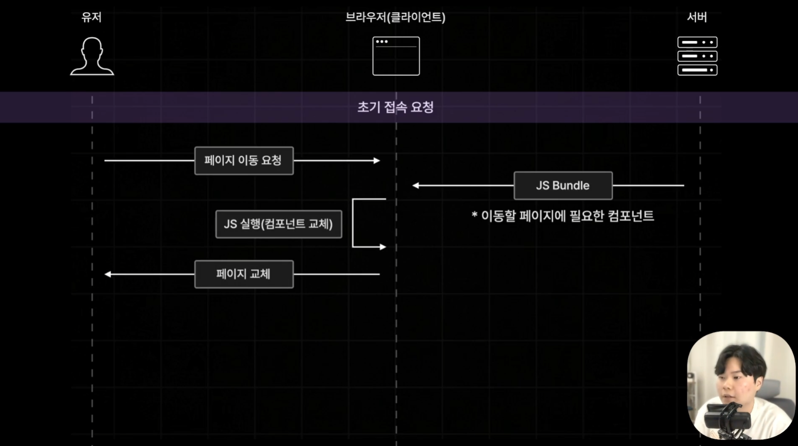
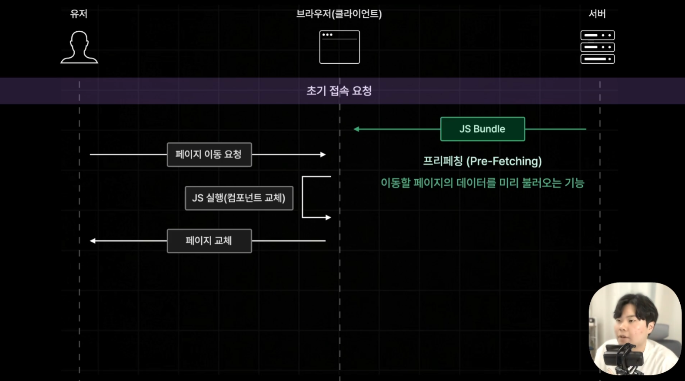
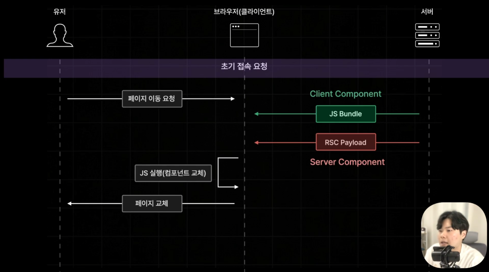
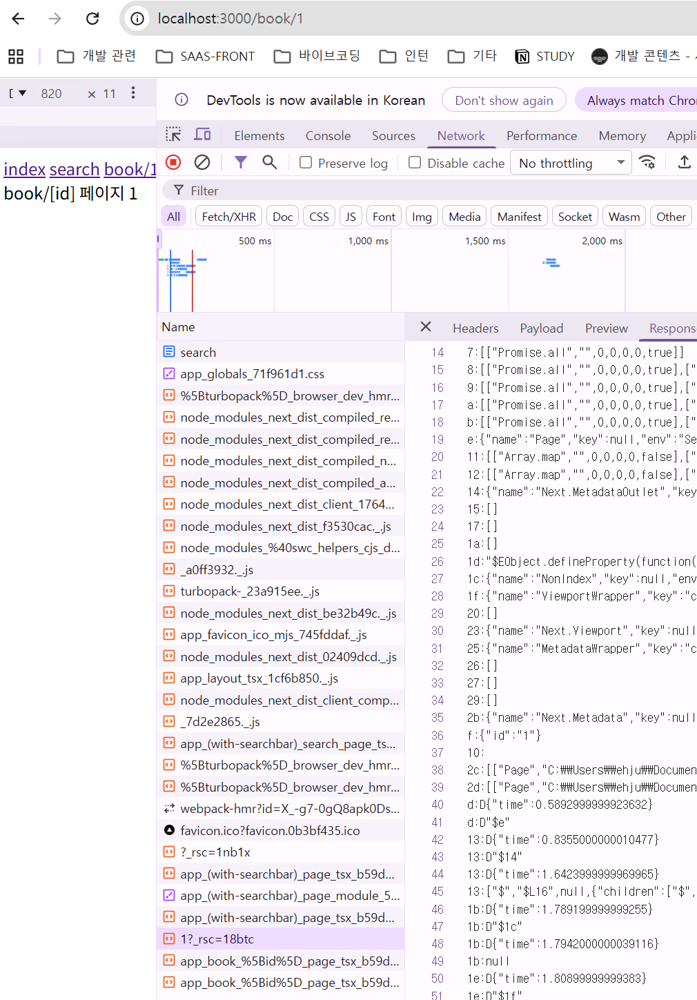
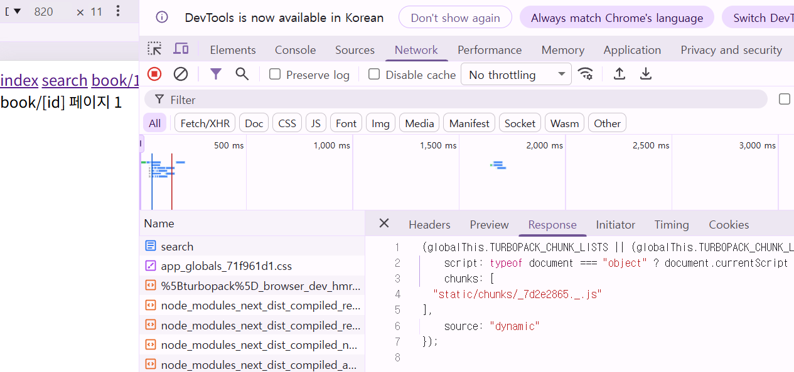

# 네비게이팅 

## Page Router vs App Router의 네비게이팅

### 기존 Page Router의 네비게이팅

0. (JS Bundle Prefetching)
1. 초기 접속 요청
2. 페이지 이동 요청
3. JS  Bundle 파일
4. JS 실행 (컴포넌트 교체)
5. 페이지 교체

### App Router의 네비게이팅

1. JS Bundle, RSC Payload  
(JS Bundle에 이미 서버 컴포넌트 내용은 빠져있음.)  
(RSC Payload를 통해 클라 내용도 같이 보내준다. Server Component 정보를 포함함.)  

## 실습

페이지 초기 로드로 JS 실행 및 렌더링된 HTML 반환 후..

1. 링크 추가 후 Search 페이지 클릭 시

    

    현재 search 페이지가 서버 컴포넌트로만 이루어져있음.  
    그래서 아직 RSC 페이로드만 있음.  

2. Search/page.tsx에 Component 추가 후  
   index -> search 페이지(서버 + 클라 컴포넌트로 구성)로 이동해보면  

    RSC 페이로드(Server Component)와  
      
    JS Bundle(Client Component)  
    

    둘 다 함께 가져오는 것을 볼 수 있다.