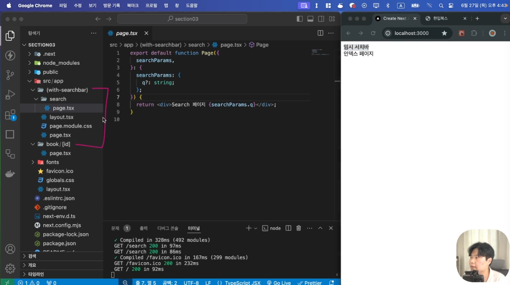

### 페이지 라우팅 설정하기

- `[id].tsx`: `Catch All Segment` 방식
- `[[...id]].tsx`: `Optional Catch All Segment` 방식, 중첩된 페이지까지 대응해줌.

**상세 페이지 보기** (Parameter, `/book/123`)

```typescript
// book/[id]/page.tsx (=> )
export default async function Page({
  params,
}: {
  params: Promise<{ id: string | string[] }>;
}) {
  const { id } = await params;

  return <div>book/[id] 페이지 {id}</div>;
}
```

**검색** (Querystring, `/search?q=은희`)

```typescript
// search/page.tsx (=> )
export default async function Page({
  searchParams,
}: {
  searchParams: Promise<{ q?: string }>;
}) {
  const { q } = await searchParams;

  return <div>Search 페이지 {q}</div>;
}
```


### Route Group (라우트 그룹)

- 경로상에는 아무런 영향도 미치지 않음.
- 일부 페이지에만 적용되는 Layout을 설정할 때 유용하다.


그림에서 `(with-searchbar)`에 레이아웃 설정했을때 `/`, `/search?query=은희` 입력 시 모두 검색바가 보여지는 것을 알 수 있음.



```typescript
// /layout.tsx
// (레이아웃 코드 생략)

// /(루트에는 페이지 넣지 않음)

// (with-searchbar)/layout.tsx
import { ReactNode } from "react";

export default function Layout({
  children,
}: {
  children: ReactNode;
}) {
  return (
    <div>
      <div>임시 서치바</div>
      {children}
    </div>
  );
}

// (with-searchbar)/page.tsx
// /로 접속 시 '임시 서치바, 인덱스 페이지' 보여짐
import styles from "./page.module.css";

export default function Home() {
  return <div className={styles.page}>인덱스 페이지</div>;
}

// (with-searchbar)/search/page.tsx
// /search?q=은희로 접속 시 '임시 서치바, Search 페이지 은희'로 보여짐
```
