# React Server Component

- React 18v부터 새로 추가된 새로운 유형의 컴포넌트
- 서버측에서만 실행되는 컴포넌트 (브라우저에서 실행 X)

### Server Component 이전의 이야기
: Page Router 버전의 Next.js에는 어떤 문제가 있었을까?

**기존의 페이지 라우터**

불필요한 컴포넌트가 있더라도 무조건 2번 렌더링하므로 TTI가 늦어지게 된다는 이슈가 있었음

상호작용이 필요 없는 컴포넌트이더라도 페이지에 들어있기만 하면 일단 무조건 브라우저에 던졌었음

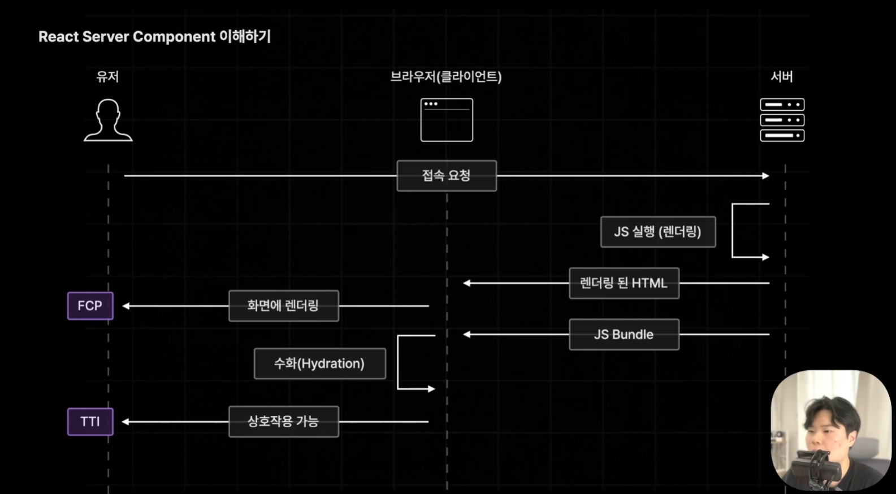
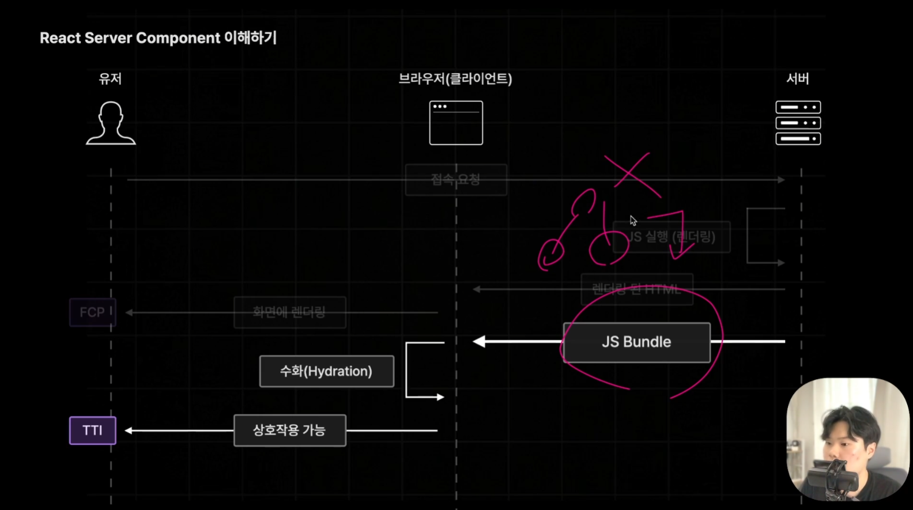
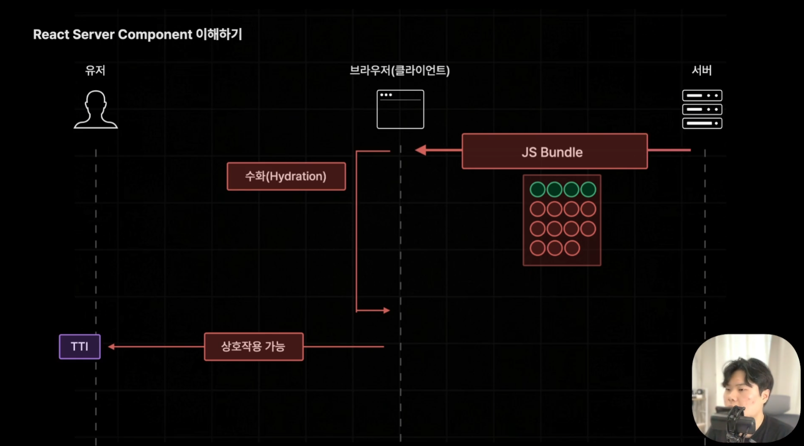


**서버 컴포넌트 - 사전렌더링 중 번들에 포함될 필요 없었던 컴포넌트는 정리**

- 자바스크립트 번들이 작아져 다운받는 시간이 줄어들기때문에 JS 번들 및 TTI까지의 시간이 빨라진다.

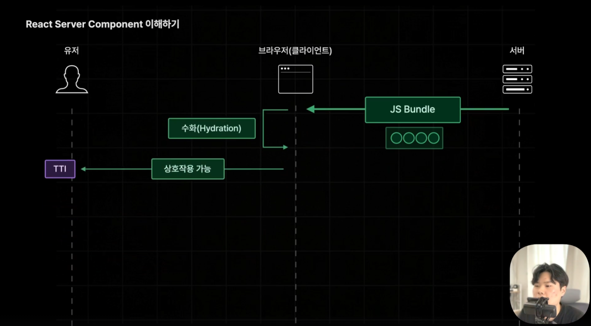
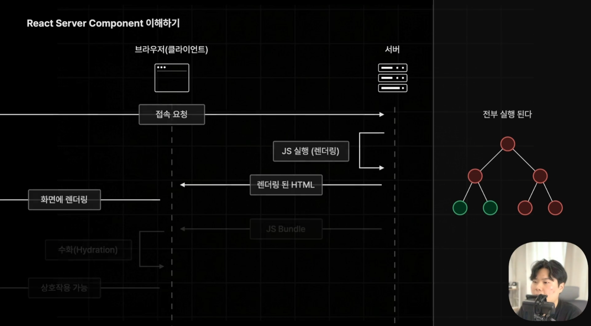

hydration을 위해 두번째로 실행하는 번들에는 클라이언트 컴포넌트만 포함함.

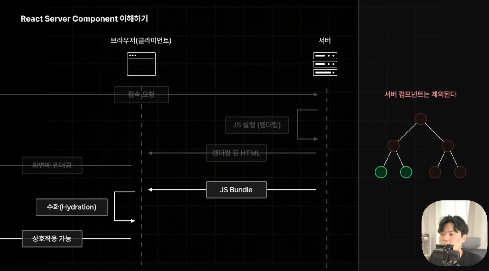


위와 같이 클라이언트 컴포넌트는 두 번 실행되므로 
페이지의 대부분을 서버 컴포넌트로 구성할 것을 권장함.  
클라이언트 컴포넌트는 꼭 필요한 경우에만 사용할 것

앱 라우터는 기본적으로 모든 컴포넌트가 서버 컴포넌트임.


### Server component vs Client component? 

- 상호작용이 있는지 없는지로 구분!
    * Link는 아님. `<a>`로 변환되는 브라우저의 기본 동작이므로 대상 X


### 컴포넌트 위치

- page.tsx로 페이지가 구분되므로 이 컴포넌트를 구현하기 위한 컴포넌트들을 아래에 넣을 수도 있음.  
- 이를 co-location이라고 부름.  
(그런데 라우트를 이리저리 오가며 쓰는 것들도 있을것같은데.. 
그런 것들을 컴포넌트 폴더에 넣는다면 양쪽에 넣을 바에 fsd가 편하지 않나?)

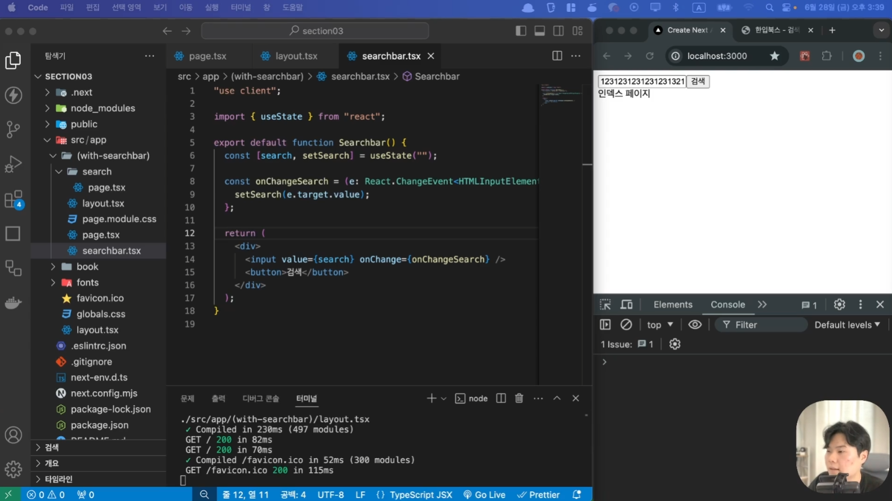

### 서버 컴포넌트 사용 시 주의사항

1. 서버 컴포넌트에는 브라우저에서 실행될 코드가 포함되면 안된다.
  (React Hooks, 이벤트 핸들러, 브라우저에서 실행되는 기능을 담고있는 라이브러리)

2. 클라이언트 컴포넌트는 클라이언트에서만 실행되지 않는다.
  (사전 렌더링에서 한 번 실행, 하이드레이션에서 한 번 더 실행)

3. 클라이언트에서 서버 컴포넌트를 import 할 수 없다.
  (그럼에도 불구하고 서버 컴포넌트를 밑에 사용하면 Next.js가 자동으로 서버 컴포넌트를 클라이언트 컴포넌트로 변경함.)

부득이하게 서버 컴포넌트를 클라 아래에 넣어야 하는 상황이라면,  
client component에서 server componnet를 import하는 것보다는  
아래와 같이 합성 컴포넌트로 사용

```typescript
// ServerComponent -> ClientComponent -> ServerComponent(불가!)

// (with-searchbar)/page.tsx

<ClientComponent>
  <ServerComponent />
</ClientComponent>

// (with-searchbar)/client-component.tsx

export default function ClientComponent({ children }) {
    return (
        <div>
            {children}
        </div>
    )
}
```

4. 서버 컴포넌트에서 클라이언트에게 `직렬화되지 않는 Props`는 전달 불가하다.

**요약 : 서버 컴포넌트에서 클라이언트로 보내주는 데이터는 직렬화된 데이터로 바꿀 수 있는 것(JSON 형태)만 가능하다**


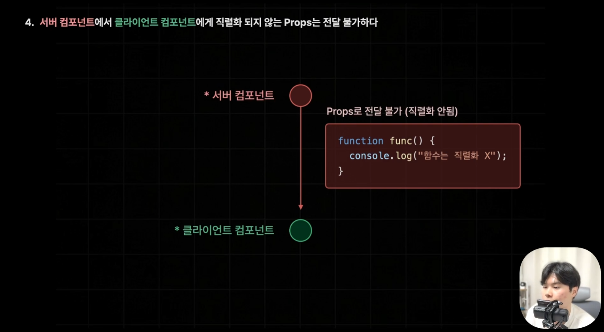

함수는 직렬화(Serialization)가 불가능함.

1) 
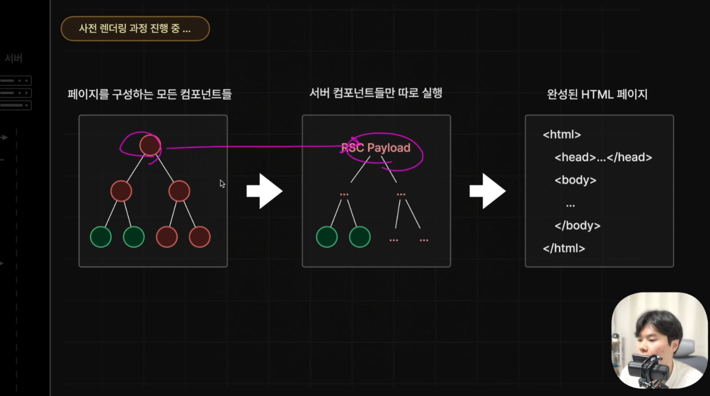


2) ***RSC Payload의 역할 분석***
---

단계 1: **(RSC Payload 생성)**
서버 컴포넌트만 먼저 따로 실행되어 RSC Payload라는 JSON과 비슷한 형태의 결과물을 직렬화해서 만듭니다.

이 Payload 안에는 서버 컴포넌트의 결과물과, 그 안에 **포함된 클라이언트 컴포넌트의 위치 및 Props 데이터**가 담깁니다.

단계 2: (클라이언트 컴포넌트 실행)

브라우저는 이 설계도를 받아서 클라이언트 컴포넌트를 생성하고 UI를 완성합니다.

이 때 서버 컴포넌트에서 클라이언트 컴포넌트에 props로 함수로 넣으면 전달되지 않습니다.

> **왜 전달이 안될까? (직렬화의 한계)**

자바스크립트 함수는 어떠한 값이 아닌 코드 블록을 가진 특수한 값이기도 하고 렉시컬 환경 등의 복잡한 값(Context, Closure...)을 갖고있기때문에 이러한 실행 맥락을 글자로 바꿔서 브라우저로 보낼 방법이 없음. 따라서 직렬화하기 어려움.

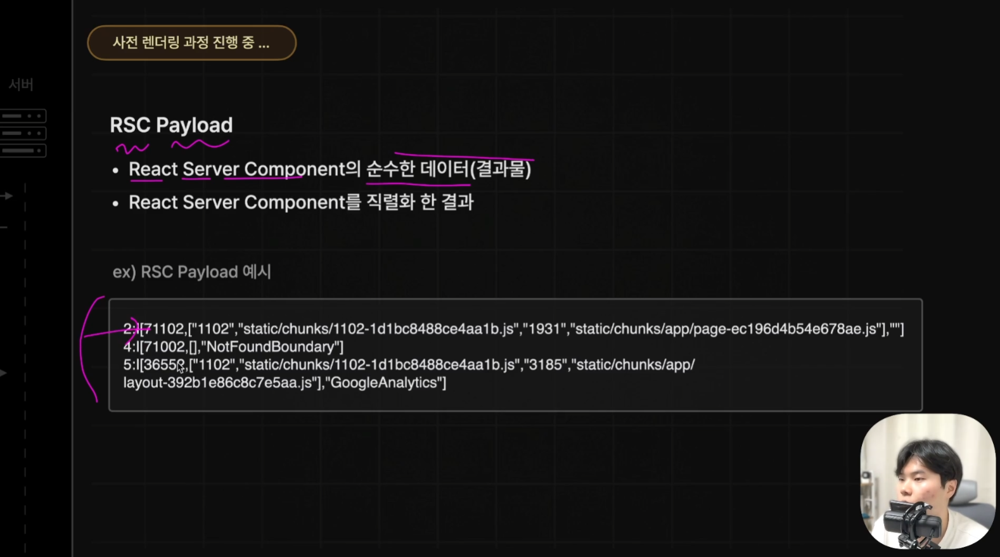
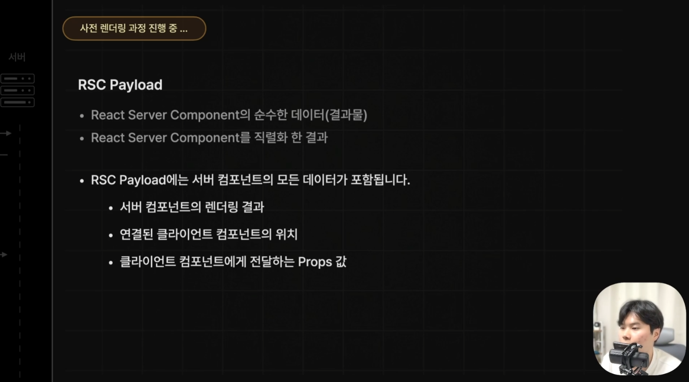

- Payload에는 서버 컴포넌트의 모든 데이터가 포함됨.
- 사전 렌더링 중 서버 컴포넌트들이 RSC 페이로드로 먼저 렌더되고 클라이언트가 마저 실행되어서 생성이 완료되게 된다.
- RSC 페이로드로 만드는 과정에서 클라에게 함수 형태에 props로 전달하고 있다면 함수도 함께 직렬화되어야하는데 그게 불가능함. 함수는 직렬화가 불가능하기 때문.


**실패하는 케이스**

```typescript
// 서버 컴포넌트
export default function ServerComponent() {
  const handleServerAction = () => { console.log("서버 함수"); };

  // 에러 발생! 함수는 직렬화가 불가능해서 클라이언트로 넘길 수 없음.
  return <ClientComponent action={handleServerAction} />;
}
```


✅ 해결 방법:

- 클라이언트 컴포넌트 내부에서 정의: 함수는 브라우저에서 직접 정의해서 사용합니다.

- Server Actions 사용: Next.js의 특수한 기능인 'use server' 함수를 사용하면 예외적으로 함수를 전달하는 것처럼 구현할 수 있습니다.