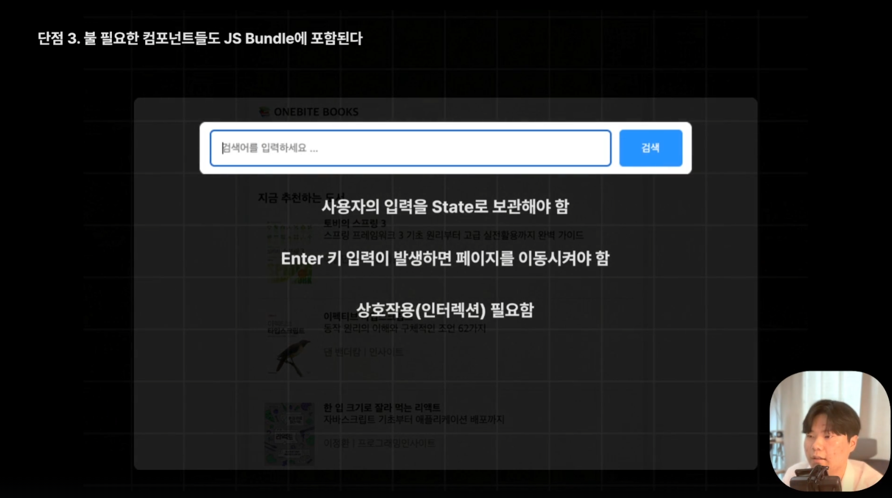
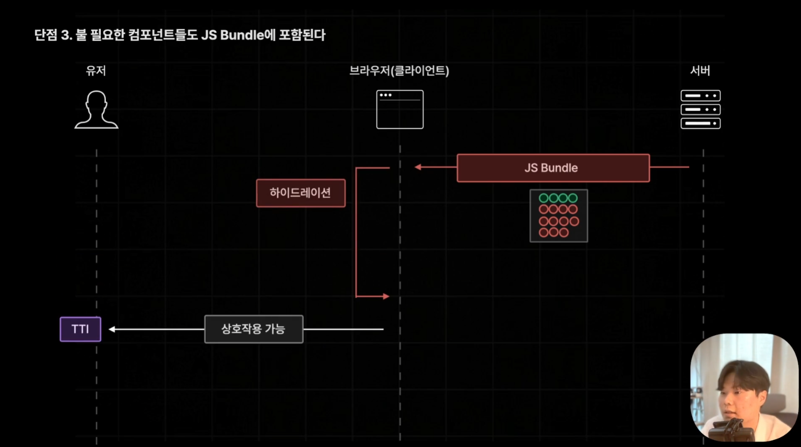

# PAGE ROUTER

### Page Router의 장점

- 파일 시스템 기반의 간편한 페이지 라우팅 제공
- 다양한 방식의 사전 렌더링 제공
    1. **서버 사이드 렌더링(SSR)**:
        * 요청이 들어올때마다 사전 렌더링을 진행함
    2. **정적 사이트 생성(SSG)**:
        * 빌드 타임에 미리 페이지를 사전 렌더링해둠
    3. **증분 정적 재생성(ISR)**:
        * SSG 페이지 일정 시간마다 재생성

### Page Router의 단점

- 페이지별 레이아웃 설정이 번거롭다. (ex. getLayout)
    * => 이후 이 부분이 `app router`에서 `layout.tsx`로 개선됨
- 데이터 페칭이 페이지 컴포넌트에 집중된다.
    * 서버에서 불러온 데이터는 Page에 props정보로 들어오는 구조를 따르기때문에, 하위가 필요한 정보가 있으면 다 상위에서 써야함.
    * 부모에 fetch가 다 몰려있고 이를 하위에 전달해줘야하는 과정이 번거롭다.
- 불필요한 컴포넌트들도 JS 번들에 포함된다.
    * FCP 시점 이후 후속 Hydration으로 주는 과정에서 불필요한 컴포넌트도 전달된다.
    * 불필요한 컴포넌트란? 상호작용하는 기능이 없기때문에 Hydration될 필요 없는 컴포넌트.
        * 한 번 JS렌더링을 위해 실행 된 후, hydration을 위해 한 번 더 실행되어 총 두 번 실행되는데,
        HTML로만 렌더링되던 컴포넌트에 상호작용이 가능하도록 hydration이 진행됨.
        * 그런데 이 때 다시 생각해보면 상호작용이 없는 컴포넌트도 분명히 있었음. 이것들은 JS 번들에만 필요한데, 페이지라우터는 그에 상관없이 무조건 한 번씩 재빌드함.
    * => `app router`에서는 이를 해결하기 위해 여기서 상호작용이 필요없는 컴포넌트를 `Server Component`라고하여 서버에서만 실행되도록 하고 최종적으로 자바스크립트 번들에 포함되지 않도록 할 수 있다.

