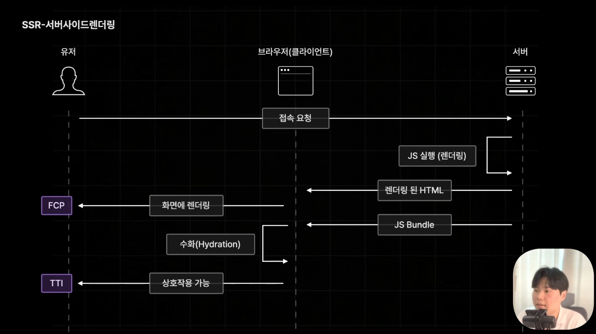
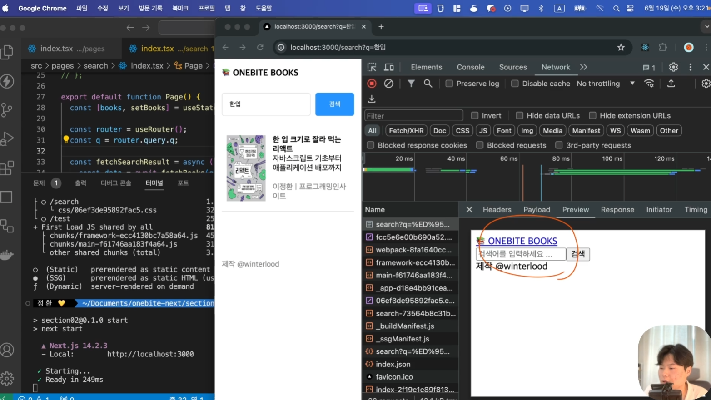
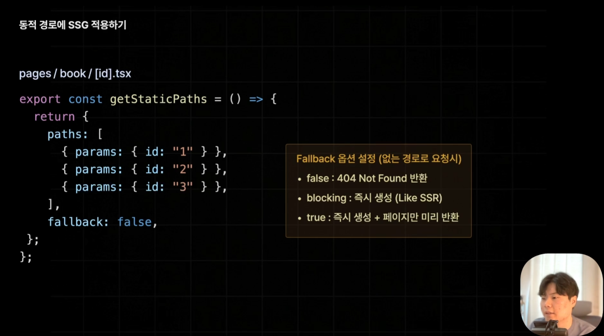

# SSR vs SSG vs ISR


### SSR - 동적 사이트 생성
- 서버사이드 렌더링의 경우 매번 접속 요청시마다 새롭게 요청하기때문에, 항상 최신 버전으로 가져올 수 있다는 장점이 있다
- 하지만 양이 많거나 무거운 연산인 경우 브라우저의 로딩을 기다리면서 불편함을 느낄 수 있다.

- 빌드 시 기호 표기
    - (SSG) 기호: Static HTML로 사전 렌더링 된 페이지다. (getStaticProps를 사용해서 불러오는 페이지다.)
    - (Dynamic) 기호: 브라우저부터 요청을 받을때마다 Dynamic하게 가져올거라는 의미
    - (Static) 기호: 404, /test와 같이 아무것도 정의되지 않은것. 기본값은 SSG와 동일하게 동작.
 



```typescript
// src/pages/index.tsx
import type { InferGetServerSidePropsType } from 'next';

export const getServerSideProps = async () => {}

export default function Home(props: InferGetServerSidePropsType<typeof getServerSideProps>) {}
```


### SSG - 정적 사이트 생성

- 미리 한 번만 생성 후 더이상 생성하지 않음. (빌드타임에 미리 HTML을 렌더링 한 후 보내기만 함). 사전 렌더링이 오래 걸리는 페이지라도 빠르게 응답할 수 있다.
- 언제 요청해도 매번 같은 페이지를 응답하므로 최신 데이터 반영은 어렵다.

- getStaticProps로 한 페이지에는 context자체에 query값이 없으므로 search페이지에서 id를 가져올 수 없다. (빌드 타임에서는 알 수 없기 때문!)
    - 원한다면 클라이언트 페이지 안에서 useEffect로 검색 결과를 불러오도록 작성해야 함.
    - 클라이언트 페이지에서 작성한 경우 search 결과만 빼고 사전렌더링 된 결과를 먼저 보내주는 것을 알 수 있음
- `fallback`
    - `false`: 404페이지로 이동
    - `blocking`: 즉시 생성 (.next 확인 시 book/4.html로 생성함) -> 신규 글 생성하게 되는경우 유용. 하지만 SSR방식으로 생성할때 백엔드에 추가적으로 api 요청이 필요한 시간이 있는 경우 로딩 발생. 오랜 시간을 기다려야 하는 경우가 생길 수 있다.
    - `true`: 즉시 생성 + 페이지만 미리 반환. blocking의 단점을 보완하여 props 없는 페이지 먼저 즉시 반환함.







```typescript
// src/pages/search/[id].tsx
export const getStaticPaths = () => {
  return {
    paths: [
      { params: { id: "1" } }, // 반드시 문자열이어야함.
      { params: { id: "2" } },
      { params: { id: "3" } },
    ],
    // 위에 명시하지 않은 path로 접속 요청을 보내면
    // 묻지도 따지지도 말고 404로 보내줘. (기본)
    fallback: false,

    // OR...
    // 없으면 생성하되 일단 props없는 버전의 HTML 먼저 렌더링
    fallback: true,
  };
};


export const getStaticProps = async (
  context: GetStaticPathsContext
) => {
  const id = context.params!.id;
  const movie = await fetchMovieDetail(Number(id));

  // 찾은 영화 데이터가 진짜 없으면 404로 이동시켜줘 
  if (!movie) {
    return {
        notFound: true,
    }
  }

  return {
    props: {
      movie,
    }
  }
}


export default function Page({
  movie
}: InferGetStaticPropsType<typeof getStaticProps>) {}
```


### ISR(Incremental Static Regeneration) - 증분 정적 재생성

단순히 SSG 방식으로 생성된 페이지를 일정 주기로 재생성하는 기술임.

- 60초가 지난 후 요청하면 일단 V1을 보내주고나서 V2를 생성함.
-   그리고 다시 접속하면 V2를 보여줌
- Index 페이지의 경우 `가장 추천하는 영화`라는 애가 있는데, 현재 getStaticProps로 된 페이지로 해두니 빌드타임에만 생성하는애라 바뀌지가 않고있음.
    - ISR로 적용하는게 가장 적합한 친구!
- 가장 강력한 사전 렌더링 방식이다.


```typescript
export const getStaticProps = async () => {
  return {
    props: {
      allBooks,
      recommendedBooks,
    },
    revalidate: 3, // 3초마다 재생성
  }
}
```


**ON-DEMAND ISR (주문형 재검증)**
    - 시간과 관계없이 사용자의 데이터가 업데이트 되는 페이지는 사전 렌더링이 어려움 (게시글 수정 / 삭제 필요)
    - 불필요한 페이지 재생성 발생하게 된다는 추가적인 문제가 있음.
    - SSR인 경우 사용자가 많은 경우 부하까지 걸릴 수 있다. 그러므로 요청을 기반으로 (게시글 요청이 트리거) 페이지를 업데이트 할 수 있음.


